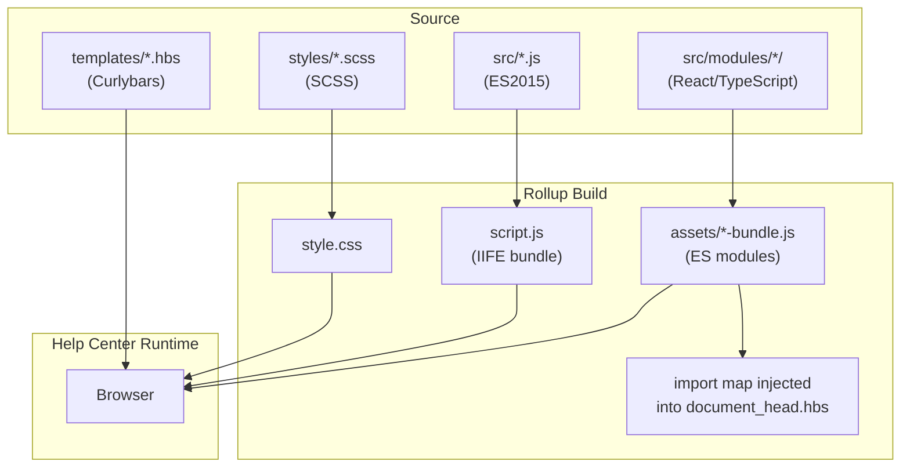

# Copenhagen Theme

## System Overview

Copenhagen is the default Zendesk Guide (Help Center) theme — a Curlybars-based theme with React components for complex UI elements. It combines legacy vanilla JS, SCSS stylesheets, and modern React/TypeScript modules, all compiled by Rollup into deployable assets. The theme is installed into Zendesk Help Centers and customized via Theming Center or the GitHub integration. See `AGENTS.md` for commands and coding conventions.

## Architecture Diagram

## Component Map

| Directory/File | Responsibility | Key Notes |
|---|---|---|
| `templates/` | Curlybars (`.hbs`) page templates | Subset of Handlebars — not all Handlebars features supported |
| `src/index.js` | Entry point for legacy JS | Imports all `src/*.js` files |
| `src/*.js` | Vanilla JS for dropdowns, search, forms, navigation, etc. | ES2015 only — no Babel, no newer syntax |
| `src/modules/new-request-form/` | Ticket submission form (React) | Bundled → `new-request-form-bundle.js` |
| `src/modules/request-list/` | User's requests page (React) | Bundled → `request-list-bundle.js` |
| `src/modules/service-catalog/` | Service catalog pages (React) | Bundled → `service-catalog-bundle.js` |
| `src/modules/approval-requests/` | Approval workflow UI (React) | Bundled → `approval-requests-bundle.js` |
| `src/modules/flash-notifications/` | Toast notifications (React) | Bundled → `flash-notifications-bundle.js` |
| `src/modules/shared/` | Shared utilities: Garden theme, i18n, error boundary | Bundled into `shared-bundle.js` chunk |
| `src/modules/ticket-fields/` | Reusable ticket field components | Bundled into `ticket-fields-bundle.js` chunk |
| `src/modules/test/` | Shared test utilities | Test-only, never imported in production |
| `styles/` | SCSS partials compiled into `style.css` | `index.scss` is the entry point |
| `manifest.json` | Theme settings configuration for Theming Center | Defines customizable variables (colors, fonts, etc.) |
| `settings/` | Default files for `file`-type manifest variables | |
| `assets/` | Generated bundles — do not edit directly | Regenerated by every build |
| `script.js` | Generated IIFE bundle — do not edit directly | Regenerated by every build |
| `style.css` | Generated stylesheet — do not edit directly | Regenerated by every build |
| `bin/` | Build scripts: string extraction, translation updates, a11y audits | Node scripts run via `yarn` commands |
| `translations/` | Top-level translations YAML for non-React strings | |

## Build Flow

1. `yarn build` triggers Rollup with two configurations:
   - **IIFE config**: bundles `src/index.js` → `script.js` (no Babel, no TypeScript)
   - **ES module config**: bundles each `src/modules/*/index.tsx` → `assets/*-bundle.js`
2. During the ES module build, the `generateImportMap` Rollup plugin creates an import map and injects it into `templates/document_head.hbs`
3. The import map maps module names to asset URLs using the Zendesk `{{asset}}` helper
4. At runtime, the browser uses the import map to resolve `import { x } from "module-name"` in `.hbs` templates

## Key Design Decisions

### No Babel for `script.js`
`src/*.js` files are compiled without Babel to keep the bundle output clean and predictable. This means only ES2015 syntax is safe — avoid `async/await`, optional chaining, nullish coalescing, and other modern features in legacy JS files.

### Isolated React Modules
ESLint enforces that each module in `src/modules/` may only import from `shared/`, `test/`, `ticket-fields/`, or `flash-notifications/`. Modules must not import from each other's internals. This keeps modules independently deployable.

### Import Maps for Asset Resolution
Zendesk renames assets when a theme is installed, so modules cannot use hardcoded file paths. The import map (generated at build time and injected into `document_head.hbs`) maps stable module names to the actual renamed asset URLs at runtime.

### Curlybars vs Handlebars
Templates use Curlybars, a subset of Handlebars. Not all Handlebars features are available. Check Zendesk's Help Center Templates documentation before using advanced Handlebars constructs.

### Translation Architecture
React modules use `react-i18next` with a flat JSON format and `.` as the plural separator (not the default `_`). Each module owns its translations in `src/modules/[module]/translations/`. The `bin/extract-strings.mjs` script extracts strings from source code into YAML files for Zendesk's internal translation system.

## External Dependencies

| Service / Tool | Purpose | Access Pattern |
|---|---|---|
| Zendesk Help Center API | Public REST API for articles, requests, users, etc. | HTTP from browser (public endpoints only) |
| Zendesk ZCLI | Local theme preview during development | `yarn start` → `zcli themes:preview` |
| Zendesk Garden | React component library (`@zendeskgarden/*`) | npm package imports |
| Zendesk Translation System | Provides translated strings for all locales | `yarn i18n:update-translations` fetches locale files |

## Cross-Cutting Concerns

### Accessibility
All UI changes must be WCAG 2.1 compliant. Run `yarn test-a11y` (requires a running preview) for automated Lighthouse accessibility audits. See `README.md` for details on development vs. CI modes.

### Internationalization
Use `t("key", "Default English value")` from `react-i18next` in all React components. Run `yarn i18n:extract` after adding new strings. Do not use `_` as a plural separator — the project is configured to use `.`.

### Generated Files
Never edit `script.js`, `style.css`, or any file in `assets/` — they are regenerated on every build and your changes will be overwritten.
